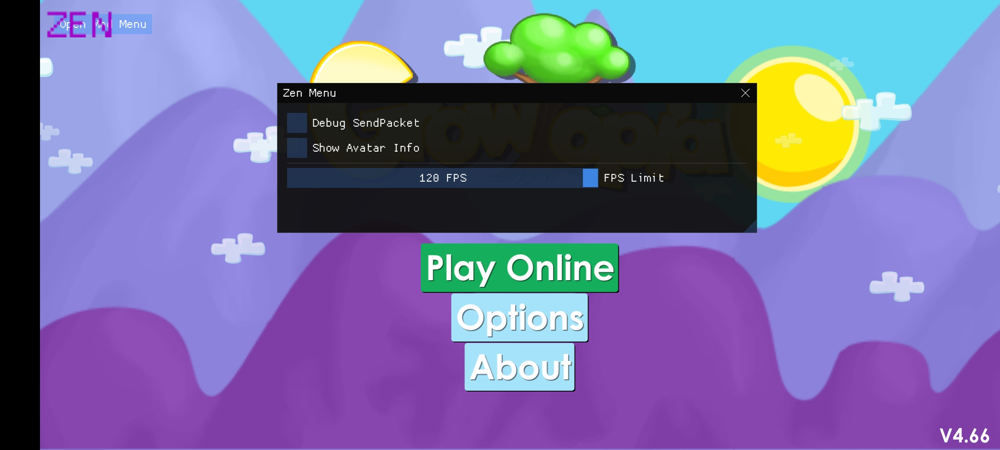
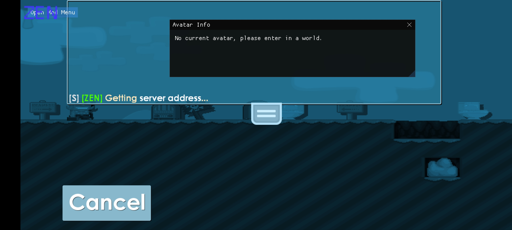
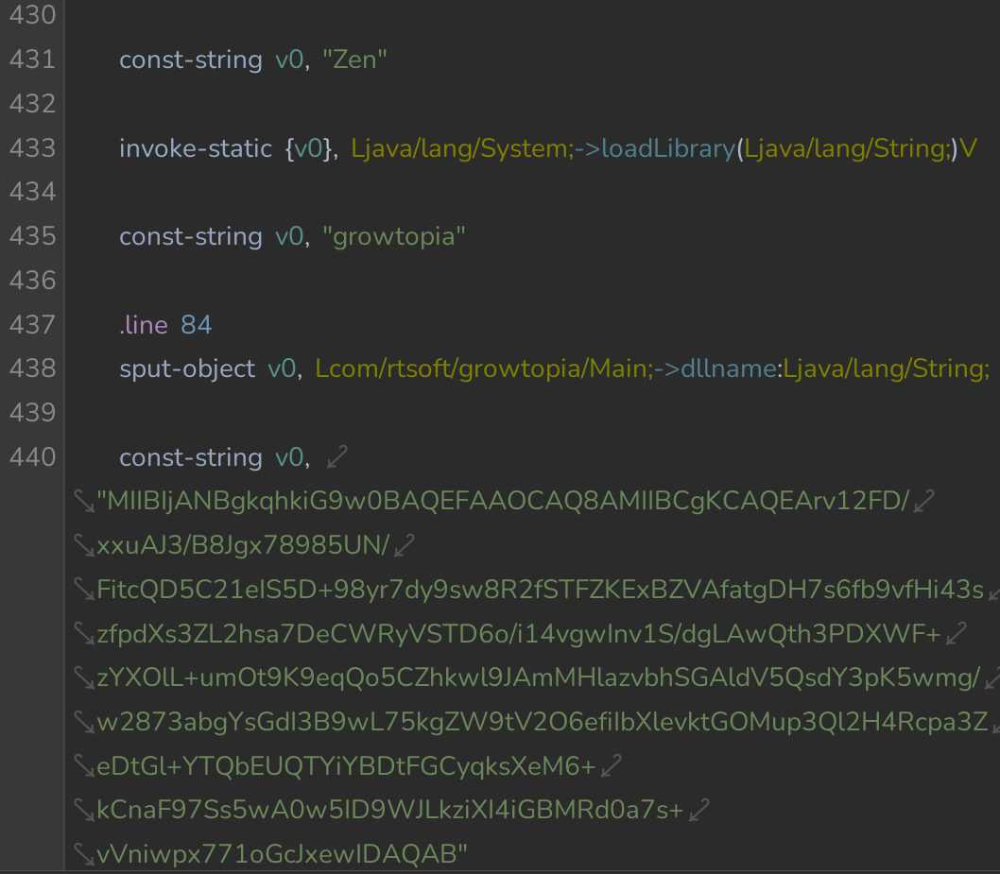

[](https://github.com/Zaenalos/Zen/releases)

---

# Zen
**Zen**, A mod menu for Growtopia (Android)

---

## ⭐ Screenshots





---

## 📦 How to Build

Building Zen is straightforward, and the following steps will guide you through the process. You can use **Termux** or any **Linux** command line.

### Requirements

Ensure the following are installed on your system:
- **Clang**
- **[Termux-NDK](https://github.com/lzhiyong/termux-ndk)** (for Android development)

### Step-by-Step Guide

1. **Clone the repo**:
   Clone the repository:
   ```bash
   git clone https://github.com/Zaenalos/Zen
   ```
   
2. **Important**:
   After cloning the repo, don't forget to set the location of your Termux-NDK toolchain in this [line](https://github.com/Zaenalos/Zen/blob/main/CMakeLists.txt#L3).

3. **Set up the Build Directory**:
   Create the build directory where the project files will be compiled:
   ```bash
   cd out/build
   ```

4. **Generate the Build Files**:
   Inside the `out/build` directory, generate the build files by running:
   ```bash
   cmake ../..
   ```

5. **Build the Project**:
   Use the following command to build the project with multiple threads.
   ```bash
   cmake --build . --parallel
   ```

6. **Locate the Output**:
   After a successful build, the shared library `libZen.so` will be generated in [this](https://github.com/Zaenalos/Zen/blob/main/CMakeLists.txt#L32) directory (Feel free to modify the output location.).

7. **Injecting to Growtopia**:
   Injecting in Growtopia is super easy:
   1. Download and install Growtopia then decompile the app.
   2. After decompiling the main app, decompile the **base.apk**.
   3. Decompile the **classes3.dex**, go to **com/rtsoft.growtopia/Main**.
   4. Inject this dalvik code in this location:
      
      ```dalvik
      const-string v0, "Zen"
	  invoke-static {v0}, Ljava/lang/System;->loadLibrary(Ljava/lang/String;)V
      ```
   5. Recompile the **base.apk**
   6. Decompile the **split_config.arm64_v8a.apk**, goto **lib/arm64-v8a**.
   7. Add the **libZen.so**, then recompile the **split_config.arm64_v8a.apk**.
   8. Install the modded apk and have fun!
   
---

## ▶️ Video Tutorial

https://github.com/Zaenalos/Zen/blob/main/Tutorial.mp4

---

## 💻 Credits

Zen wouldn't be possible without the help of these amazing open-source projects:

- **[ShadowHook](https://github.com/bytedance/android-inline-hook)**: A fast and dynamic Android inline hook library, used in Zen for hooking system functions.  
  
- **[ImGui](https://github.com/ocornut/imgui)**: A powerful and flexible graphical user interface library, used for creating Zen's mod menu.  

- **[Termux-NDK](https://github.com/lzhiyong/termux-ndk)**: A toolchain for developing Android native code in Termux, used for building Zen on Android devices.  

---

## 🫱🏻‍🫲🏿 Contributing

Contributions are welcome! If you have ideas for new features or improvements, feel free to fork the repository and submit a pull request. I have no time to improve and continue this project so it's up to you guys!

---